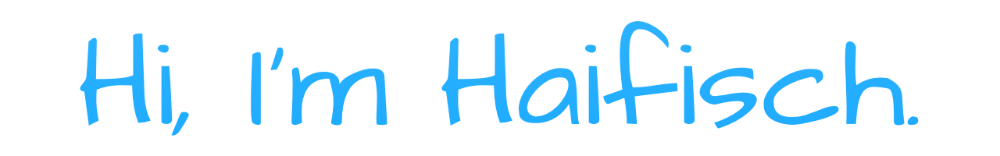

<pre>
Self-taught computer software engineer from Reno, Nevada. Interests in all things Science™ and open data.
Here's some of my favorite languages, frameworks, and tools from over the years. 
</pre>

<h3>Languages</h3>

  
  
  
  
  
  
   
  
  
  
  
  
  

<h3>Frameworks</h3>

	
	
	
	
	
	
	

<h3>Tools</h3>

	 
	 
	
	
	
	
	
	

<h3>Find me</h3>

<!-- this this grows with age -->